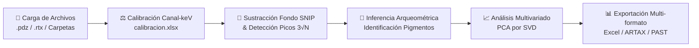

# 🔬 XRF Analyzer Pro - CNCPC

> **Plataforma de Procesamiento Masivo, Caracterización Elemental e Interpretación Arqueométrica de Espectros XRF**


**XRF Analyzer Pro** es una solución científica de escritorio de alto rendimiento diseñada para la visualización, calibración de canal a energía, sustracción de fondo continuo (bremsstrahlung), identificación elemental semiautomática y análisis estadístico multivariado de espectros de Fluorescencia de Rayos X (XRF). 

Desarrollada específicamente para el estudio no destructivo del patrimonio cultural, obras de arte y materiales arqueológicos, la plataforma permite procesar de manera masiva datos espectrales provenientes de espectrómetros portátiles de rayos X (pXRF) y sistemas de laboratorio.

---

## 📑 Tabla de Contenidos

- [🔬 XRF Analyzer Pro - CNCPC](#-xrf-analyzer-pro---cncpc)
  - [📑 Tabla de Contenidos](#-tabla-de-contenidos)
  - [📌 Visión General](#-visión-general)
  - [✨ Características Principales](#-características-principales)
    - [📊 Visualización e Interacción Espectral](#-visualización-e-interacción-espectral)
    - [🧹 Procesamiento Físico-Matemático de Espectros](#-procesamiento-físico-matemático-de-espectros)
    - [🎨 Motor Arqueométrico e Identificación de Pigmentos](#-motor-arqueométrico-e-identificación-de-pigmentos)
    - [📈 Análisis Estadístico Multivariado (PCA)](#-análisis-estadístico-multivariado-pca)
    - [🗂️ Gestión Jerárquica de Proyectos y Espectros Suma](#️-gestión-jerárquica-de-proyectos-y-espectros-suma)
  - [🏗️ Arquitectura del Proyecto](#️-arquitectura-del-proyecto)
  - [📁 Formatos Soportados y Matriz de Exportación](#-formatos-soportados-y-matriz-de-exportación)
    - [Formatos de Entrada](#formatos-de-entrada)
    - [Matriz de Exportación](#matriz-de-exportación)
  - [💻 Instalación y Requisitos del Sistema](#-instalación-y-requisitos-del-sistema)
    - [Requisitos Previos](#requisitos-previos)
    - [Opción 1: Windows (Iniciador Rápido Automático)](#opción-1-windows-iniciador-rápido-automático)
    - [Opción 2: Linux / macOS (Línea de Comandos)](#opción-2-linux--macos-línea-de-comandos)
  - [⚡ Guía de Flujo de Trabajo](#-guía-de-flujo-de-trabajo)
  - [🧪 Pruebas Unitarias Automatizadas](#-pruebas-unitarias-automatizadas)
  - [🏛️ Créditos e Institución](#️-créditos-e-institución)
  - [📄 Licencia](#-licencia)

---

## 📌 Visión General

El análisis no destructivo por Fluorescencia de Rayos X portatil (pXRF) genera grandes volúmenes de espectros en formatos binarios o propietarios (`.pdz`, `.rtx`). La interpretación arqueométrica requiere diferenciar picos de emisión característicos del radiador XRF de los componentes del pigmento, remover el fondo continuo por radiación de frenado (*bremsstrahlung*) y asociar combinaciones elementales con fases minerales o pigmentos históricos.

**XRF Analyzer Pro** unifica la lectura directa de espectros, la calibración espectral lineal, el filtrado de ruido estadístico y algoritmos multivariados en una interfaz gráfica intuitiva, eliminando la dependencia de software propietario costoso y permitiendo reportar análisis estandarizados para la conservación e investigación patrimonial.

---

## ✨ Características Principales

### 📊 Visualización e Interacción Espectral
- **Ejes dinámicos:** Representación en kilo-electronvoltios ($\text{keV}$) contra Conteos Netos o Tasa de Conteos ($\text{CPS} = \text{Conteos} / \text{Tiempo Vivo}$).
- **Líneas de Referencia Elemental:** Marcado dinámico e interactivo de series de líneas caracteristicas ($K\alpha$, $K\beta$, $L\alpha$, $L\beta$, $M\alpha$).
- **Etiquetado sobre Gráfica:** Marcadores flotantes interactivos de centros de masa espectrales.
- **Rangos de Energía:** Ajustes rápidos predeterminados ($16\text{ keV}$, $30\text{ keV}$, $40\text{ keV}$) o configuración de escala manual por usuario.
- **Superposición de Espectros:** Visualización comparativa simultánea entre espectros individuales y espectros promediados/suma.

### 🧹 Procesamiento Físico-Matemático de Espectros
- **Calibración Canal-Energía Automática:** Ajuste de conversión lineal $E(\text{keV}) = m \cdot \text{Canal} + b$ leyendo tablas externas de calibración (`calibracion.xlsx`).
- **Sustracción de Fondo SNIP:** Algoritmo *Statistics-sensitive Non-linear Iterative Peak-clipping* (SNIP) para la estimación no destructiva de la radiación de frenado continua (*bremsstrahlung*).
- **Detección de Picos Adaptativa:** Filtro de picos basado en el criterio de significancia estadística respecto al nivel de ruido Poisson ($\text{Señal} \ge 3\sqrt{N_{\text{fondo}}}$).
- **Integración de Área Neta y Bruta:** Cálculo automático del área bajo el pico mediante ventanas adaptativas descontando el continuo local.

### 🎨 Motor Arqueométrico e Identificación de Pigmentos
- **Base de Datos Arqueométrica Integrada:** Motor de inferencia basado en reglas para la discriminación de pigmentos históricos y compuestos minerales:
  - **Rojos / Naranjas:** Bermellón / Cinabrio ($\text{HgS}$), Minio ($\text{Pb}_3\text{O}_4$), Realgar ($\text{As}_4\text{S}_4$), Hematita ($\text{Fe}_2\text{O}_3$).
  - **Amarillos:** Amarillo de Plomo-Estaño ($\text{Pb}_2\text{SnO}_4$), Oropimente ($\text{As}_2\text{S}_3$), Goethita ($\text{FeO(OH)}$).
  - **Azules / Verdes:** Azurita ($\text{Cu}_3(\text{CO}_3)_2(\text{OH})_2$), Malaquita ($\text{Cu}_2\text{CO}_3(\text{OH})_2$), Cardenillo / Resinato de Cobre, Verde Esmeralda ($\text{Cu-As}$).
  - **Blancos:** Blanco de Plomo ($2\text{PbCO}_3\cdot\text{Pb(OH)}_2$), Yeso ($\text{CaSO}_4\cdot2\text{H}_2\text{O}$), Calcita ($\text{CaCO}_3$), Blanco de Titanio ($\text{TiO}_2$), Blanco de Zinc ($\text{ZnO}$).
  - **Negros:** Negro de Hueso / Marfil ($\text{Ca}_5(\text{PO}_4)_3\text{OH}$ + $\text{C}$), Negro de Manganeso ($\text{MnO}_2$).
- **Estimación Semicuantitativa de Fases:** Aproximación porcentual de constituyentes mayores (ej. Yeso, Calcita, Óxidos de Hierro).
- **Filtrado de Artefactos:** Identificación automática de líneas scattering originadas por el tubo de Rayos X ($\text{Rh}$, $\text{Pd}$).
- **Modo Discernir Elementos:** Opción para aislar únicamente elementos seleccionados manualmente por el investigador.

### 📈 Análisis Estadístico Multivariado (PCA)
- **Descomposición por Valores Singulares (SVD):** Análisis de Componentes Principales ejecutado sobre matrices de covarianza o correlación a lo largo de canales espectrales configurables.
- **Gráficas de Puntuaciones (Scores) y Cargas (Loadings):** Visualización bidimensional para agrupamiento estadístico, variabilidad espectral e identificación de familias de muestras.
- **Alineación de Signos Automatizada:** Corrección de la ambigüedad de signo en los vectores propios de SVD para consistencia inter-sesión.

### 🗂️ Gestión Jerárquica de Proyectos y Espectros Suma
- **Soporte Drag & Drop:** Carga interactiva mediante arrastrar y soltar archivos o estructuras completas de carpetas (`tkinterdnd2`).
- **Cálculo de Espectros SUMA:** Generación automática e instantánea del espectro acumulado por carpeta o subclase.
- **Reorganización en Árbol:** Modificación de estructuras de grupos, traslado de nodos y persistencia del estado jerárquico.

---

## 🏗️ Arquitectura del Proyecto

```text
xrf_analysis/
├── xrf_analysis.py         # Módulo principal de la aplicación GUI (Tkinter, Matplotlib, Eventos)
├── lectura_espectros.py    # Motor backend: Parseo de archivos (.pdz, .rtx), SNIP, PCA, Pigmentos
├── test_analysis.py        # Suite de pruebas unitarias automatizadas (unittest)
├── run_xrf.bat             # Script automatizado de ejecución y configuración en Windows
├── requirements.txt        # Lista de dependencias de Python
├── LICENSE                 # Licencia de software libre (MIT)
├── README.md               # Documentación general del proyecto
└── docs/                   # Archivos de prueba, datos espectrales de muestra y proyectos (.rtx, .xlsx, .xls)
```

### Descripción de Componentes Backend

| Módulo / Función | Ubicación | Descripción Funcional |
| :--- | :--- | :--- |
| `obtener_calibracion` | `lectura_espectros.py` | Busca y ajusta una regresión lineal sobre archivos `calibracion.xlsx`. |
| `leer_pdz` | `lectura_espectros.py` | Extrae metadatos y arreglo de canales de archivos binarios `.pdz` mediante `pdz-tool`. |
| `parsear_rtx` | `lectura_espectros.py` | Parser XML para deserializar árboles de muestras y espectros de Bruker ARTAX. |
| `calcular_fondo_snip` | `lectura_espectros.py` | Implementación iterativa del algoritmo SNIP para remoción de radiación continua. |
| `buscar_picos` | `lectura_espectros.py` | Detección estadística de picos por umbral de ruido Poisson $\ge 3\sqrt{N}$. |
| `sugerir_pigmentos` | `lectura_espectros.py` | Sistema experto de inferencia arqueométrica a partir de firmas elementales. |
| `calcular_pca_espectros` | `lectura_espectros.py` | Ejecución de PCA mediante SVD sobre la matriz espectral seleccionada. |
| `XRFProcessorGUI` | `xrf_analysis.py` | Controlador de interfaz de usuario Tkinter, vinculación DnD y representación gráfica Matplotlib. |

---

## 📁 Formatos Soportados y Matriz de Exportación

### Formatos de Entrada

| Formato | Tipo de Archivo | Origen / Equipamiento |
| :--- | :--- | :--- |
| **`.pdz`** | Espectro binario de alta resolución | Bruker Tracer III-V / Tracer 5i |
| **`.rtx` / `.rrtx`** | Proyecto XML de espectroscopía XRF | Bruker ARTAX |
| **Directorios** | Estructuras jerárquicas de carpetas | Sistema de archivos local o en red |

### Matriz de Exportación

La aplicación permite generar reportes estandarizados orientados a la publicación, intercambio de datos y procesamiento estadístico complementario:

```
                  ┌── Exportación ARTAX Filtrado (todos.xls / todos.xlsx)
                  ├── Exportación Excel Universal (univ.xlsx)
                  ├── Exportación con Gráficas Integradas por Hoja (sheets.xlsx)
Opciones de ─────┼── Proyecto XML Bruker ARTAX (.rtx)
Exportación       ├── Matriz de Espectros para PAST (.dat / .txt)
                  └── Matriz Elemental para PAST (.dat / .txt)
```

| Modalidad de Exportación | Descripción | Formato Salida | Caso de Uso Recomendado |
| :--- | :--- | :--- | :--- |
| **ARTAX Filtrado** | Genera un archivo con pestañas `Parameter` y `Points`, estandarizando nombres de muestras y filtrando únicamente las columnas de elementos seleccionados en las líneas de referencia. | `.xls` / `.xlsx` | Compatibilidad directa con flujos de trabajo Bruker ARTAX. |
| **Excel Universal** | Matriz consolidada de muestras con metadatos (tiempo vivo, kV, $\mu\text{A}$), conteos netos, conteos de fondo e identificación elemental. | `.xlsx` | Análisis masivo en hojas de cálculo y minería de datos. |
| **Gráficas por Hoja** | Libro Excel con pestañas individuales por muestra, incluyendo gráficos de espectro Matplotlib vectorizados en alta resolución. | `.xlsx` | Reportes ejecutivos de conservación y archivos de dictamen. |
| **Proyecto ARTAX** | Serializa la sesión de trabajo actual y su estructura de muestras en XML compatible con el software ARTAX. | `.rtx` | Intercambio de proyectos entre laboratorios equipados con ARTAX. |
| **Exportación PAST** | Formatea matrices espectrales o de áreas elementales con encabezados aptos para paquetes estadísticos paleontológicos/arqueológicos. | `.txt` / `.dat` | Análisis multivariado avanzado (Cluster Analysis, LDA, DCA) en **PAST**. |

---

## 💻 Instalación y Requisitos del Sistema

### Requisitos Previos
- **Python:** Versiones `3.9`, `3.10`, `3.11`, `3.12` o `3.14`.
- **Sistemas Operativos:** Windows 10/11, Ubuntu/Debian Linux, macOS Monterey o posterior.

### Opción 1: Windows (Iniciador Rápido Automático)

El proyecto incluye un script de procesamiento automatizado para Windows que gestiona la creación del entorno virtual y la instalación de dependencias sin intervención manual:

1. Clona o descarga este repositorio.
2. Haz doble clic en el archivo **`run_xrf.bat`**.
3. El script detectará la instalación de Python, creará el entorno `venv_win`, instalará los paquetes requeridos y lanzará la aplicación.

### Opción 2: Linux / macOS (Línea de Comandos)

1. **Clonar el repositorio:**
   ```bash
   git clone https://github.com/Geenska/xrf_analysis.git
   cd xrf_analysis
   ```

2. **Instalar paquetes del sistema (Solo Linux Debian/Ubuntu):**
   ```bash
   sudo apt update
   sudo apt install python3-tk python3-venv
   ```

3. **Crear y activar el entorno virtual:**
   ```bash
   python3 -m venv .venv
   source .venv/bin/activate
   ```

4. **Instalar dependencias de Python:**
   ```bash
   pip install --upgrade pip
   pip install -r requirements.txt
   ```

5. **Ejecutar la aplicación:**
   ```bash
   python xrf_analysis.py
   ```

---

## ⚡ Guía de Flujo de Trabajo



1. **Carga de Datos:** Arrastra archivos `.pdz`, proyectos `.rtx` o carpetas completas a la zona de carga en el panel izquierdo.
2. **Visualización & Marcado:** Selecciona una muestra del árbol jerárquico. Activa las líneas de emisión caracteristicas ($K\alpha, L\alpha, \dots$) desde la lista de verificación elemental.
3. **Ajuste de Fondo & Picos:** Habilita el cálculo del fondo continuo mediante la pestaña de procesamiento (SNIP iterativo) para inspeccionar áreas netas.
4. **Interpretación de Pigmentos:** Revisa las sugerencias del motor arqueométrico en el panel lateral para asociar elementos con pigmentos históricos.
5. **Estadística Multivariada:** Dirígete a la pestaña **PCA** para ejecutar el agrupamiento estadístico sobre el rango espectral de interés.
6. **Reporte y Exportación:** Utiliza el menú *Exportar* para seleccionar el formato requerido (`todos.xls`, `univ.xlsx`, `sheets.xlsx`, o matrices para `PAST`).

---

## 🧪 Pruebas Unitarias Automatizadas

El repositorio cuenta con una suite de pruebas automatizadas con `unittest` que verifica la integridad de los algoritmos backend:

- Verificación de coeficientes de calibración lineal ($m \approx 0.02$, $b \approx 0.022$).
- Lectura y alineación de canales en archivos `.pdz`.
- Consistencia del parser XML `.rtx`.

Para ejecutar la suite de pruebas:

```bash
python test_analysis.py
```

---

## 🏛️ Créditos e Institución

Este software ha sido desarrollado para el **Laboratorio CÓDICE** y la **CNCPC** (*Coordinación Nacional de Conservación del Patrimonio Cultural - Instituto Nacional de Antropología e Historia, INAH*), apoyando las tareas de procesamiento masivo, caracterización espectral no destructiva e investigación arqueométrica en bienes culturales muebles e inmuebles.

---

## 📄 Licencia

Este proyecto se distribuye bajo la licencia **MIT**. Consulta el archivo [`LICENSE`](LICENSE) para obtener más información.
